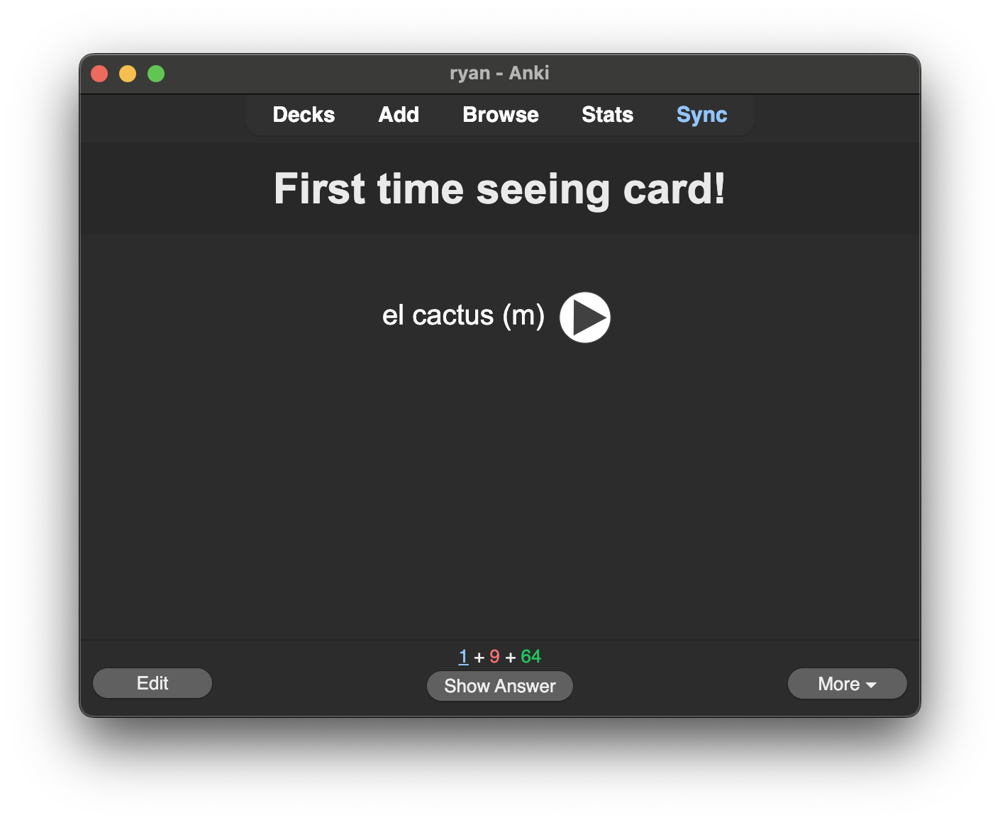
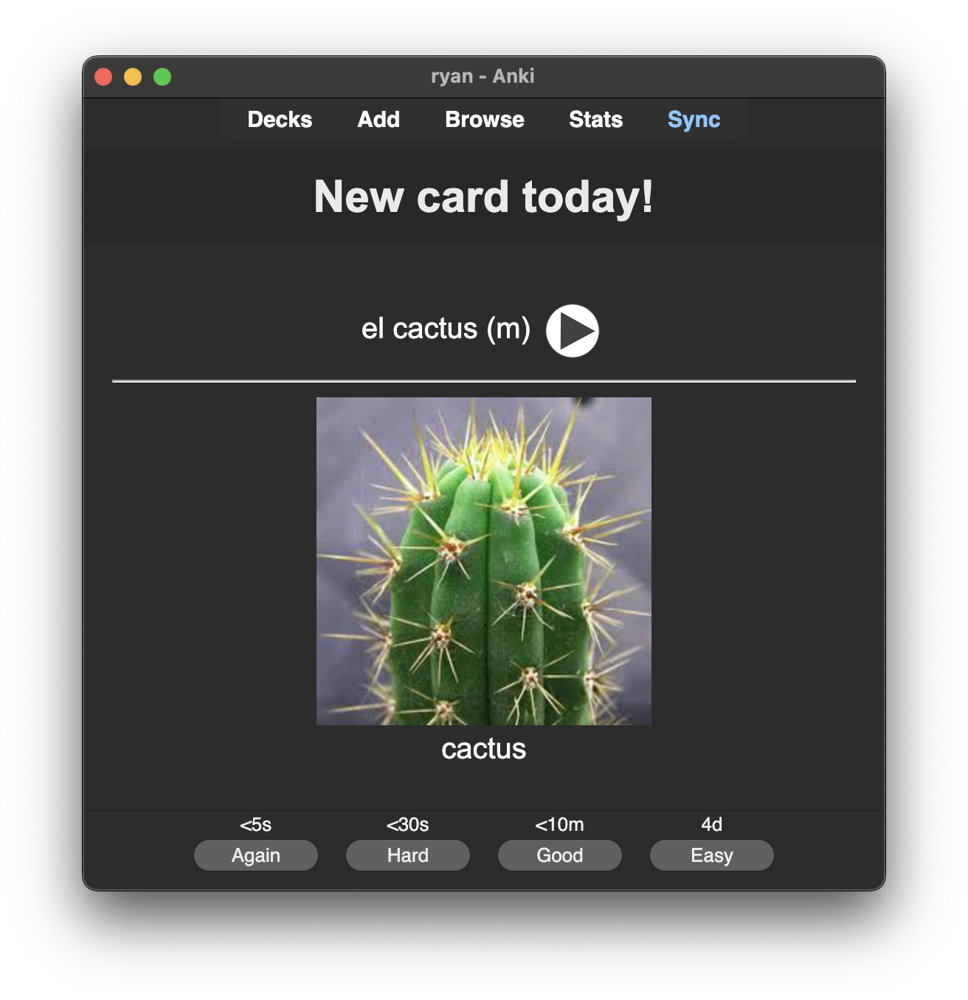

# anki newcard plugin

### First time seeing new card

Shows alert at the top of the card when it is first time ever seeing a card.

### Card is new for today

Then afterwards, if it is the first day seeing a card.

